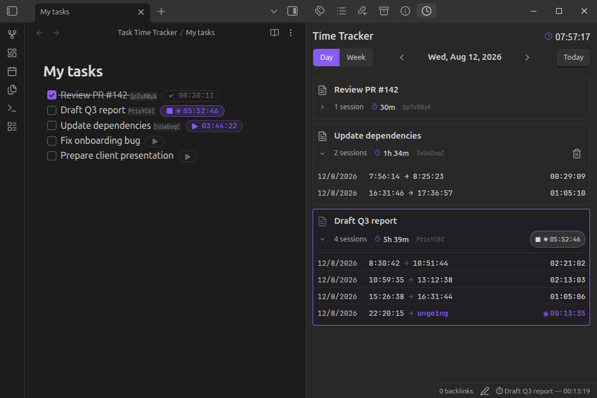
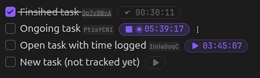
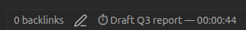
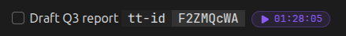
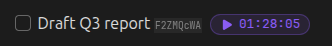
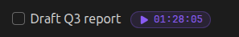
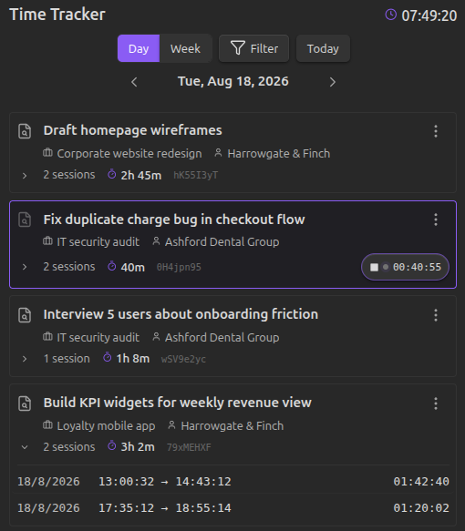
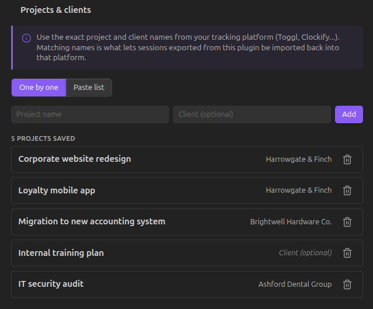
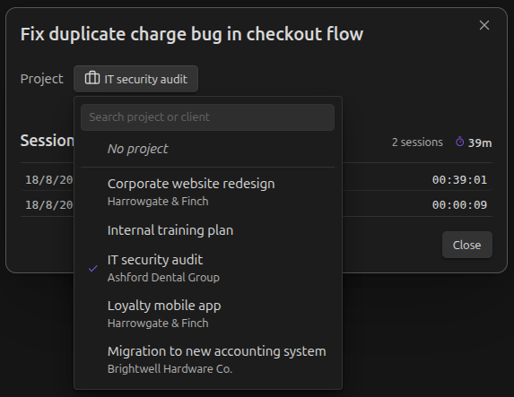
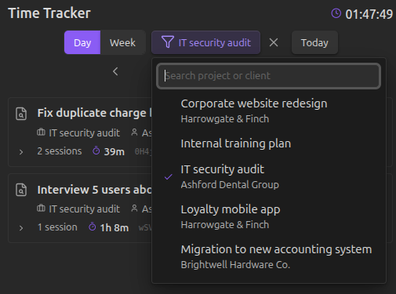

# Task Time Tracker

 
 

A local-first Obsidian plugin for **tracking time directly on the checkboxes in your notes** — compatible with the Tasks plugin format, with no external services involved at any point.

**Obsidian has no native way to track time on your work**. Existing plugins mostly focus on Pomodoro-style sessions, or don't integrate with the checkbox-based task format already used across vaults — and none of them combine tracking with exporting your time to the tools you already use.

 <a href="https://community.obsidian.md/plugins/task-time-tracker">➔ Install it from the Obsidian Community Plugins directory.</a>

## Contents

- [How it works](#how-it-works)
- [Features](#features)
- [Projects & clients](#projects--clients)
- [Commands](#commands)
- [Privacy & architecture](#privacy--architecture)
- [Export](#export)
- [Installation](#installation)
- [About](#about)
- [License](#license)

## How it works

1. **Open a note** with a checkbox task — no special setup or template required.
2. **Start tracking** from a command or the icon next to the task's checkbox.
3. **Watch the status bar** — a live timer shows the task name and elapsed time as you work.
4. **Stop when you're done** — one click closes the session. Switching tasks does this automatically.
5. **Check off the task — and tracking wraps up on its own**. Marking a task done (or cancelled) stops any active tracking automatically and saves the session, no extra step needed. Reopen the task later and you can pick up tracking again.
6. **Review your history** — sessions grouped by task, with day and week navigation.

### Where you can interact with the tracker

The play/stop icon and the live counter only appear where Obsidian renders an editable view of the note — that is, in **Edit/Source mode** on the note itself.

They won't appear in any read-only rendering of the task, even though the task and its recorded time are exactly the same underlying data. This includes:
- **Reading mode**
- **Embedded notes** (`![[note#^block]]`)
- **Any query or dataview-style result** (Tasks, Dataview, or similar plugins) — these render a non-editable visualization of the task, not the task itself

To start or stop tracking, switch to Edit mode on the note, or use the **History panel** — which works everywhere, regardless of how the task is normally displayed.

The status bar at the bottom of Obsidian always shows the active task (or "No active tracking"). Clicking anywhere on it opens the History panel — this works regardless of the note's mode, and even with no timer running.

### The task identifier

Every tracked task gets a short, unique identifier stored inline with the task text (`[tt-id:: ...]`), so your history stays linked to the right task even if you edit or move it. Keeping your notes uncluttered matters to us, so this identifier is **subtle by default** — and you're never stuck with how it looks out of the box:

- Go to **Settings → Task identifier format** to choose between **Normal** (fully visible), **Reduced** (small and low-opacity — the default), or **Hidden** entirely.
- This styling requires the [Dataview](https://github.com/blacksmithgu/obsidian-dataview) plugin — Dataview is what renders the identifier at all, so it's also what makes it queryable (e.g. `WHERE tt-id = "..."`) and stylable. **Dataview is entirely optional**: tracking, history, and export all work exactly the same without it.
- Without Dataview installed, the identifier is shown as plain text (e.g. `[tt-id:: a3f9k2mp]`) — this is a known limitation of relying on Dataview for the styling, not a bug.
- In Source mode, the raw identifier is always visible regardless of this setting, so you can always find and inspect it if needed.

**Normal** — shown as Dataview would normally render any inline field.

**Reduced** *(default)* — same information, styled to blend in and stay out of the way while you read your notes.

**Hidden** — the identifier isn't rendered at all, though it's still there in the note and your Dataview queries on `tt-id` keep working.

## Features

- **Local-first, always available** — tracking works entirely offline. The plugin never depends on network access for day-to-day use.
- **One timer, no confusion** — only one active timer at a time. Switching tasks closes the previous session automatically, without losing data.
- **Fits your task format** — works with Tasks-style checkboxes (`- [ ]`, `* [ ]`, `+ [ ]`), numbered lists, and nested tasks.
- **Plays nicely with Dataview, but never depends on it** — an optional, subtle-by-default identifier keeps your history linked to each task and makes it queryable, without cluttering your notes.
- **A clear history** — a dedicated panel with per-task cards, day/week navigation, and inline editing or deletion of sessions.
- **Organize with projects & clients** — group your tasks under projects (each with an optional client) from Settings, then filter the History panel down to a single one at a time.
- **Export on your terms** — generate a generic CSV or one formatted for Toggl's official importer. You choose when to export — never automatic, never in the background.
- **Zero external API calls** — the plugin never connects to any third-party service, at any point in its operation. Your time data stays in your vault.

## Projects & clients

Group your tasks by project, and optionally by client, right from Settings.

Add projects one by one, or paste a whole list at once (`Project; Client` per line) if you're migrating from somewhere else.

Assign a project to any tracked task from its **Edit task** dialog — pick one from a searchable list, each row showing the project and its client if it has one.

Once you're tracking by project, filter the History panel down to a single one at a time with the **Filter** button in its header. The filter resets every time you reopen Obsidian, so it's never a setting you forget you left on.

## Commands

All actions are also available from Obsidian's Command Palette (`Cmd/Ctrl + P`), so you're never dependent on hovering over a checkbox or finding the status bar:

- **Time Tracker: Start tracking on current task** — starts tracking the task under your cursor.
- **Time Tracker: Stop active tracking** — stops whatever timer is currently running.
- **Time Tracker: Open time log panel** — opens the History panel.
- **Time Tracker: Export time entries...** — opens the export dialog to generate a CSV (generic or Toggl-formatted) for a chosen date range.

## Privacy & architecture

Task Time Tracker never calls an external API — not for tracking, not for exporting, not for anything.

Every session is stored locally in your vault. When you export, the plugin writes a file to disk; nothing is transmitted anywhere. You take that file and upload it yourself, whenever you choose, to the native importer of whichever platform you use.

This isn't a missing feature waiting to be built. It's a deliberate architectural decision: your time data is yours, and it doesn't leave your machine unless you decide to move it. The same philosophy applies to what the plugin puts inside your notes: the task identifier is the only thing it ever writes there, and it stays as unobtrusive as possible by default.

## Export

Two export formats are available whenever you need them:

- **Generic CSV** — opens cleanly in any spreadsheet tool.
- **Toggl-formatted CSV** — matches the exact columns expected by Toggl's official importer.

Generic CSV exports also include the project and client assigned to each task, if any — ready to use for per-client reporting. (The Toggl-formatted CSV doesn't include these columns.)

*More export formats (Clockify, Harvest, and others) are planned.*

## Installation

**Option A — Obsidian Community Plugins (recommended)**

1. Open Settings → Community plugins in Obsidian.
2. Click Browse and search for "Task Time Tracker".
3. Click Install, then Enable.

**Option B — BRAT** (for beta versions ahead of the official release)
1. Install the [BRAT](https://github.com/TfTHacker/obsidian42-brat) plugin from Community Plugins.
2. In BRAT's settings, add this repository: `Mythanar/obsidian-task-time-tracker`.
3. Enable Task Time Tracker in Community Plugins.

**Option C — Manual**
1. Download `main.js`, `manifest.json`, and `styles.css` from the [latest release](https://github.com/Mythanar/obsidian-task-time-tracker/releases).
2. Create a folder named `task-time-tracker` inside your vault's `.obsidian/plugins/` directory and place the three files there.
3. Reload Obsidian and enable the plugin in Community Plugins.

## About

Built by [Mythanar](https://mythanar.com). This plugin started as something I needed for myself, built alongside AI, because I couldn't find one that did what I actually wanted. If it works for me, maybe it'll work for someone else too.

## License

[MIT](LICENSE)